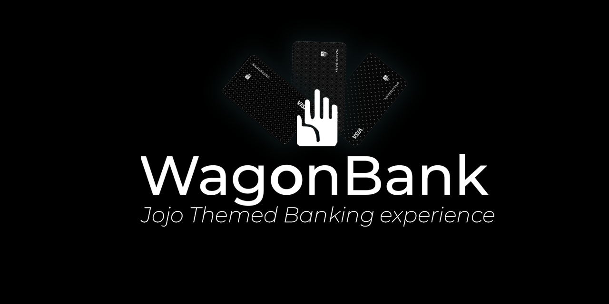
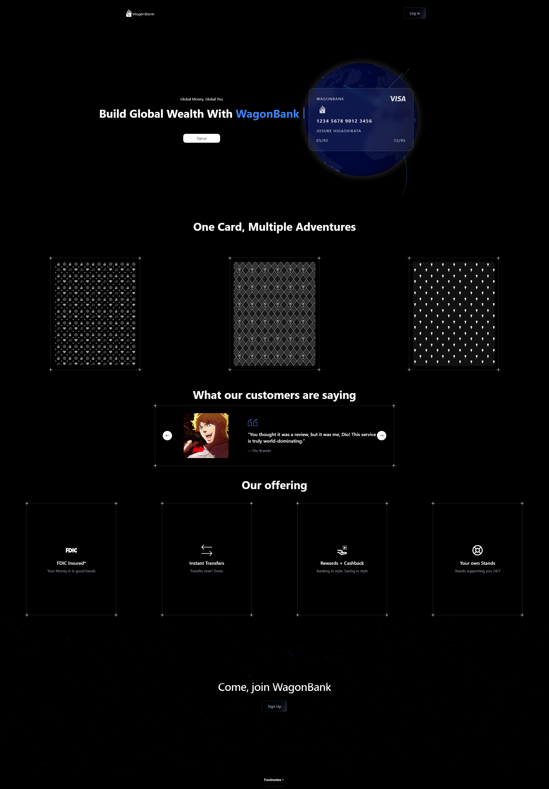

<p align="center">
</img>
</p>
<p align="center">
Where has the <b>fun</b> in banking <i>gone</i>? I have missed themed banks and I have decided to create one. 
</p>
<p align="center">
WagonBank is a Jojo-themed bank that allows you to create an account, deposit money, withdraw money, create a credit card, transact with the card, check your balance.
</p>

<h3>All jokes aside</h3>

I created this project to raise awareness about the importance of due diligence in banking. WagonBank might advertise being FDIC insured, but it's actually our banking partners who are insured, <b>not us</b>. <i>(Which we can write in the fine print, but will you read it?)</i>


</p>

## Installation
0. Ensure you have a Marqeta account setup [here](https://app.marqeta.com/development)
1. clone the repo
2. run `npm install`
3. create a `.env` file and add the following:
```
API_URL=YOUR MARQETA API URL
API_KEY=YOUR MARQETA API KEY
API_SECRET=YOUR MARQETA API SECRET
BACKEND_URL=YOUR BACKEND URL
PROGRAM_TOKEN=YOUR PROGRAM TOKEN
CARD_PRODUCT_TOKEN=YOUR CARD PRODUCT TOKEN
```
4. in the config.tsx file located in frontend/components/data, change this code
```
export const BACKEND_URL = "your backend url";
```
5. you can either build the project or for debugging/developing you can use `npm run dev` to start the frontend and use `nodemon` to start the backend


## Screenshots



[Sign Up Page](pictures/signup_page.png)

[Dashboard Page](pictures/dashboard.png)


## How does WagonBank actually Work?
Here is a simple flow of how WagonBank works:

Marqeta  <->  Backend (Express.js) <->  Frontend (Next.js + React) <-> User

- <b>Marqeta</b>: handles financial heavylifting

- <b>Backend</b>: Acts as a middleman, polishing/appending/fetching data between Marqeta and the frontend.

- <b>Frontend</b>: User interface that interacts with the backend to display data

## Contributing :sparkles:
If you would like to contribute to this project, feel free to fork the project and make a pull request. I will review it and merge it if it fits the project.

1. Fork it (https://github.com/KTK27YT/WagonBank/fork)
2. Create your feature branch ```git checkout -b feature/CoolNewFeature```
3. Commit your changes ```git commit -am 'Add some CoolNewFeature'```
4. Push to the branch ```git push origin feature/CoolNewFeature```
5. Create a new Pull Request


## Support :star2:
if you would like to support this project, just give it a star on [Github](https://github.com/KTK27YT/WagonBank). It would mean a lot to me.